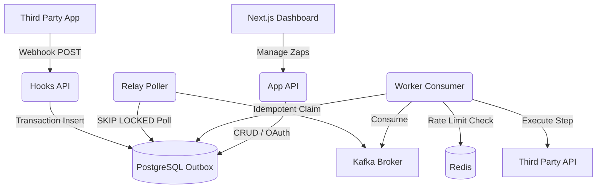

<div align="center">
  
</div>

# ZapFlow – The Platform for Distributed Workflow Automation

An enterprise-grade, open-source platform to build and deploy automated workflows. Combine a Next.js visual dashboard with a highly concurrent, fault-tolerant backend. Connect third-party APIs, handle massive webhook traffic, and execute multi-step logic seamlessly. Workflow automation you can trust with real work, from prototype to production.

---

## Key Capabilities

* **High-Throughput Webhook Ingestion:** Securely process and validate incoming third-party webhooks using raw Buffer parsing and `crypto.timingSafeEqual` to prevent Timing Attacks.
* **Zero-Drop Transactional Outbox:** Ensure perfect data consistency between Postgres and Kafka. The system uses the Transactional Outbox pattern to guarantee that no webhook is ever dropped during a broker outage.
* **Infinite Horizontal Scaling:** Deploy as many Relay pollers as you need. ZapFlow uses Postgres `FOR UPDATE SKIP LOCKED` concurrency to completely eliminate database lock contention across clusters.
* **Fault-Tolerant Execution Engine:** A custom Kafka `eachBatch` consumer and a stack-safe `while()` loop executor engine prevents V8 Memory Stack Overflows and Kafka session timeouts on massive, long-running workflows.
* **Distributed Split-Brain Protection:** A robust 5-minute database lease protocol on individual workflow steps prevents split-brain double-execution if a worker server crashes mid-flight.
* **Atomic Redis Rate Limiting:** Avoid getting banned by external APIs. Perfect Token Bucket rate limiting guaranteed by atomic Redis Lua scripting across thousands of concurrent Node.js processes.
* **Enterprise-Ready Security:** Self-host securely. All third-party OAuth access tokens are encrypted at rest using mathematically verified AES-256-GCM Authenticated Encryption.

## Quick Start

Get ZapFlow running locally in under 2 minutes:

**1. Boot the Infrastructure (Kafka, Redis, Postgres)**
```bash
docker-compose up -d
```

**2. Install Dependencies**
```bash
pnpm install
```

**3. Initialize Database & Start Servers**
```bash
cd packages/db && pnpm prisma db push && pnpm prisma generate && cd ../..
pnpm run -r dev
```

**4. Access the Platform**
- 🖥️ **Dashboard**: [http://localhost:3000](http://localhost:3000)
- 🔌 **App API**: [http://localhost:3001](http://localhost:3001)

## Architecture

ZapFlow uses a highly decoupled, event-driven architecture to guarantee delivery and execution.



## Project Structure

This repository uses a Turborepo monorepo structure to separate concerns logically.

* `apps/web`: Next.js frontend dashboard
* `apps/hooks-api`: High-throughput webhook ingestion service
* `apps/relay`: The outbox-to-Kafka transactional bridge
* `apps/worker`: The core execution engine and Kafka consumer
* `apps/app-api`: Main REST API for CRUD and OAuth connections
* `packages/db`: Shared Prisma schema and generated client

---
*Built to handle the chaos of distributed computing.*
