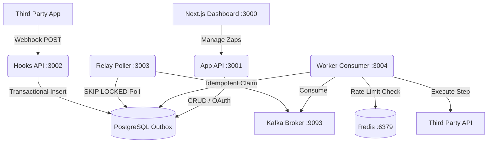

<div align="center">
  
</div>

# ZapFlow – The Platform for Distributed Workflow Automation

An enterprise-grade, open-source platform to build and deploy automated workflows. Combine a Next.js visual dashboard with a highly concurrent, fault-tolerant backend. Connect third-party APIs, handle massive webhook traffic, and execute multi-step logic seamlessly.

---

## Key Capabilities

* **High-Throughput Webhook Ingestion:** Securely process and validate incoming third-party webhooks using raw Buffer parsing and `crypto.timingSafeEqual` to prevent Timing Attacks.
* **Zero-Drop Transactional Outbox:** Ensure perfect data consistency between Postgres and Kafka using the Transactional Outbox pattern — no webhook is ever lost during a broker outage.
* **Infinite Horizontal Scaling:** Deploy as many Relay pollers as you need. Uses Postgres `FOR UPDATE SKIP LOCKED` to eliminate lock contention across clusters.
* **Fault-Tolerant Execution Engine:** A custom Kafka `eachBatch` consumer and stack-safe `while()` loop executor prevents V8 stack overflows and Kafka session timeouts on long-running workflows.
* **Distributed Split-Brain Protection:** A 5-minute database lease on individual workflow steps prevents double-execution if a worker crashes mid-flight.
* **Atomic Redis Rate Limiting:** Token Bucket rate limiting guaranteed by atomic Redis Lua scripting across thousands of concurrent processes.
* **Enterprise-Ready Security:** All third-party OAuth access tokens are encrypted at rest using AES-256-GCM.

---

## Architecture



---

## Prerequisites

Make sure the following are installed before starting:

| Tool | Version | Install |
|---|---|---|
| Node.js | ≥ 20 | [nodejs.org](https://nodejs.org) |
| pnpm | ≥ 9 | `npm install -g pnpm` |
| Docker Desktop | Latest | [docker.com](https://docker.com) |
| GNU Make *(optional, Windows)* | Any | `winget install GnuWin32.Make` |

> **Windows Make setup:** After installing, add `C:\Program Files (x86)\GnuWin32\bin` to your system PATH, then restart your terminal.

---

## Environment Setup

Copy the example env file and fill in your values:

```bash
cp .env.example .env
```

The defaults in `.env.example` work for local development out of the box — you only need to add OAuth credentials if you want Slack integration.

**Key ports used locally:**

| Service | Host Port | Notes |
|---|---|---|
| Postgres | `5433` | Docker maps 5433→5432 inside container |
| Redis | `6379` | Standard port |
| Kafka | `9093` | EXTERNAL listener for host-side services |
| App API | `3001` | |
| Hooks API | `3002` | |
| Relay | `3003` | Health check only |
| Worker | `3004` | Health check only |
| Web | `3000` | Next.js dashboard |

---

## Startup — Choose Your Method

### Method 1: Manual Dev Mode (Recommended for Development)

Each service runs with hot-reload in its own terminal. Best for active development.

**Step 1 — Start infrastructure (Postgres, Redis, Kafka)**
```bash
# with pnpm
pnpm infra:up

# with make
make infra-up
```

Wait ~30–60 seconds for Kafka to become healthy:
```bash
pnpm infra:status   # or: make infra-status   or: docker compose ps
```

All three containers should show `(healthy)` before continuing.

**Step 2 — First time only: run migrations + seed**
```bash
# with pnpm
pnpm db:setup

# with make
make db-setup

# manually
pnpm --filter @zapier-clone/db db:migrate
pnpm --filter @zapier-clone/db db:seed
```

**Step 3 — Start each service in its own terminal**

Open 5 separate terminals in the project root:

```bash
# Terminal 1
pnpm dev:api         # App API      → http://localhost:3001
# or: make dev-api

# Terminal 2
pnpm dev:hooks       # Hooks API    → http://localhost:3002
# or: make dev-hooks

# Terminal 3
pnpm dev:relay       # Relay        → http://localhost:3003
# or: make dev-relay

# Terminal 4
pnpm dev:worker      # Worker       → http://localhost:3004
# or: make dev-worker

# Terminal 5
pnpm dev:web         # Web (Next.js) → http://localhost:3000
# or: make dev-web
```

**Step 4 — Verify all services are healthy**
```bash
curl http://localhost:3001/health   # {"status":"ok","db":true}
curl http://localhost:3002/health   # {"status":"ok"}
curl http://localhost:3003/health   # {"status":"ok","db":true}
curl http://localhost:3004/health   # {"status":"ok","db":true}
```

---

### Method 2: All Services in Parallel (Single `pnpm dev`)

Turborepo runs all 5 services in parallel with a single command. Output is interleaved in one terminal.

```bash
# Step 1: start infra first
pnpm infra:up
# Wait for healthy, then run db:setup on first run

# Step 2: start everything
pnpm dev
# or: make dev
```

---

### Method 3: Full Docker Stack (Single Command — Deploy / Share)

Builds all images and starts the entire stack in Docker. Perfect for sharing the project or simulating production. **Migrations and seeding run automatically on first start.**

```bash
# One command to rule them all
pnpm docker:up
# or: make docker-up
# or: DOCKER_BUILDKIT=1 docker compose up --build -d
```

This will:
1. Build all 5 Docker images (with BuildKit layer cache — fast on subsequent runs)
2. Start Postgres, Redis, Kafka
3. Wait for infra to be healthy
4. Start app-api (auto-migrates + auto-seeds), hooks-api, relay, worker, web

Access the platform:
- 🖥️ **Dashboard**: http://localhost:3000
- 🔌 **App API**: http://localhost:3001

**View logs:**
```bash
pnpm docker:logs   # or: make docker-logs   or: docker compose logs -f
```

**Stop everything:**
```bash
pnpm docker:down   # or: make docker-down   or: docker compose down
```

**Rebuild images after code changes:**
```bash
pnpm docker:build   # or: make docker-build
pnpm docker:up
```

> **Why is `docker compose build` separate from starting containers?**
> `docker compose build` only builds **your custom Dockerfiles** (app-api, hooks-api, relay, worker, web). Postgres, Redis and Kafka use **official pre-built images** — there's nothing to build for them. `docker compose up` is what actually starts all services, including the infrastructure.

---

### Method 4: Windows One-Liner (PowerShell Script)

Opens each service in its own PowerShell window automatically:

```powershell
.\scripts\dev.ps1
```

This script automatically: starts Docker infra if not running → waits for healthy → runs migrations + seed → opens 5 service windows.

---

## Make Commands Reference

```bash
make help          # List all available targets

# Infrastructure
make infra-up      # Start Postgres, Redis, Kafka
make infra-down    # Stop all containers
make infra-status  # Show container health
make infra-logs    # Tail infra logs

# Database
make db-migrate    # Apply pending migrations (non-interactive)
make db-seed       # Seed connector catalog
make db-setup      # migrate + seed in one step
make db-reset      # ⚠️  Drop and rebuild DB
make db-studio     # Open Prisma Studio visual browser

# Dev (individual services)
make dev-api       # app-api only
make dev-hooks     # hooks-api only
make dev-relay     # relay only
make dev-worker    # worker only
make dev-web       # web only
make dev           # all services via Turborepo

# Docker
make docker-build  # Build all images
make docker-up     # Build + start full stack in Docker
make docker-down   # Stop all Docker containers
make docker-logs   # Tail all service logs

# Convenience
make start         # Start infra + print instructions for dev services
```

---

## Project Structure

```
zapier-clone/
├── apps/
│   ├── web/          Next.js 14 dashboard (port 3000)
│   ├── app-api/      REST API — CRUD, OAuth, zap management (port 3001)
│   ├── hooks-api/    Webhook ingestion — high-throughput (port 3002)
│   ├── relay/        Outbox-to-Kafka transactional bridge (port 3003)
│   └── worker/       Kafka consumer & step executor (port 3004)
├── packages/
│   ├── db/           Prisma schema, client, migrations, seed
│   └── types/        Shared TypeScript types (Kafka message contracts)
├── docker-compose.yml  Full stack (infra + all services)
├── Makefile            Developer shortcut commands
├── scripts/
│   └── dev.ps1       Windows one-click dev starter
└── turbo.json        Turborepo pipeline config
```

---

## Database Commands

```bash
# Apply migrations (non-interactive, safe to run anytime)
pnpm db:migrate

# Seed connector catalog (idempotent, uses upsert)
pnpm db:seed

# Open visual DB browser
pnpm db:studio

# ⚠️  Full reset (drops all data)
pnpm db:reset
```

To create a **new migration** after editing `schema.prisma`:
```bash
pnpm --filter @zapier-clone/db db:migrate:create
# You'll be prompted to enter a migration name
```

---

*Built to handle the chaos of distributed computing.*
